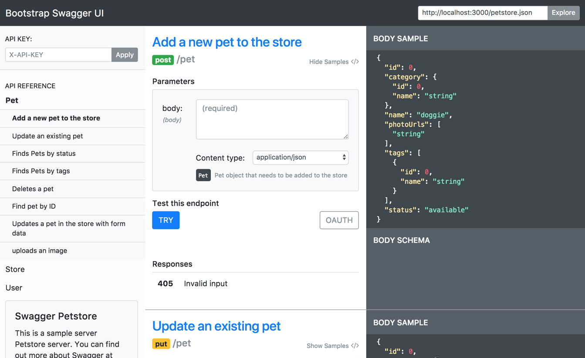
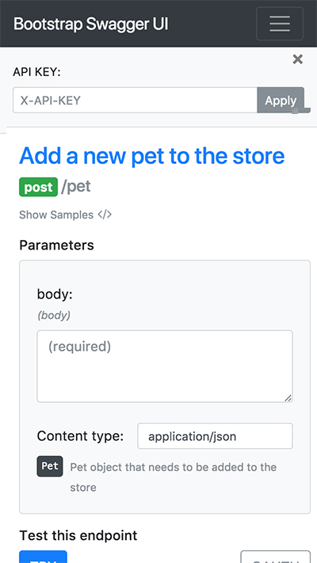

# Bootsrap Swagger UI Theme

Based off of [Swagger UI responsive theme](https://github.com/jensoleg/swagger-ui) modified to use bootstrap v4.0.0-beta.3 and refactored a bit for added flexibility.

[](http://swagger-ui.andresthegiant.com/?url=http://petstore.swagger.io/v2/swagger.json)

The theme will adapt to screen size and works on tablets and mobile phones.

[](http://swagger-ui.andresthegiant.com/?url=http://petstore.swagger.io/v2/swagger.json)

Give it a [try](http://swagger-ui.andresthegiant.com/?url=http://petstore.swagger.io/v2/swagger.json) and enter your own swagger definition.

## Customizing The Theme

* Includes Bootstrap v4.0.0-beta.3 SCSS
* Uses broserSync for live reloading

1. $`npm install`
1. $`gulp serve`
1. [Update Sass](src/main/scss)
1. [Update Templates](src/main/template)
1. [Update JS](src/main/javascript/view)

### Updating ui-assets

```
git subtree split --branch ui-assets --prefix dist/assets/ && git checkout ui-assets && git push && git checkout master
```

*Add assets as subtree*

```
git remote add -f bootstrap-swagger-ui git@github.com:afgarcia86/bootstrap-swagger-ui.git
git merge -s ours --no-commit bootstrap-swagger-ui/ui-assets --allow-unrelated-histories
git read-tree --prefix=api/app/lib/openapi/ui/assets -u bootstrap-swagger-ui/ui-assets
git commit -m "Merged bootstrap-swagger-ui ui-assets as subdirectory"
```

*update subtree*
`git pull -s subtree bootstrap-swagger-ui ui-assets --allow-unrelated-histories`

## Disclaimer

This is not a fully polished implementation and should be used with care.
